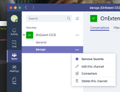

# Concourse CI Teams Resource

Sends messages to [Microsoft Teams](https://teams.microsoft.com) from
within [Concourse CI](https://concourse.ci) pipelines.

Implements the Microsoft Teams
[Connector](https://dev.outlook.com/Connectors/Reference) protocols and
the Concourse CI [resource](https://concourse.ci/implementing-resources.html)
protocols.


Resolves at runtime Concourse CI environment variables referenced in your Teams
connector messages such as:

```
$BUILD_ID
$BUILD_NAME
$BUILD_JOB_NAME
$BUILD_PIPELINE_NAME
$BUILD_TEAM_NAME
$ATC_EXTERNAL_URL
```

## STATUS

* Alpha Quality
* Works - meets my specific needs


## TODO

* Make `potentialAction` button/link optional


## SETUP

1. Create a connector in the Teams UI - go to the 'more options' menu of the
channel you want to post notifications to.

2. Select "Incoming Webhook" and save the resulting link after being prompted
for details like the icon and name of the connector.

3. Use the webhook url from above in your pipeline `source` definition.  The
example below creates an `alert` resource.  Each point in the pipeline labeled
`alert` is a Microsoft Teams Connector message.


## PIPELINE EXAMPLE


### Source Configuration

```
resources:

  - name: alert
    type: teams-notification
    source:
      url: https://outlook.office365.com/webhook/blah-blah-blah
```
* `url`: *Required.* The webhook URL as provided by Teams when you add a
connection for "Incomming Webhook". Usually in the
form: `https://outlook.office365.com/webhook/XXX`

don't forget to define the non-built-in type:

```
resource_types:

- name: teams-notification
  type: docker-image
  source:
    repository: navicore/teams-notification-resource
    tag: latest
```

## Param Configuration

example of an alert in a pull-request job
```
- name: Test-Pull-Request
  plan:
  - get: {{mypipeline}}-pull-request
    trigger: true
  - task: test-pr
    file: {{mypipeline}}-pull-request/pipeline/test-pr.yml
    on_success:
      put: alert
      params:
        text: |
          pull request tested: with no errors
        title: {{mypipeline}} Pull Request Tested
        actionName: {{mypipeline}} Pipeline
        actionTarget: $ATC_EXTERNAL_URL/teams/$BUILD_TEAM_NAME/pipelines/$BUILD_PIPELINE_NAME/jobs/$BUILD_JOB_NAME/builds/$BUILD_NAME
    on_failure:
      put: alert
      params:
        color: EA4300
        text: |
          pull request tested: **WITH ERRORS**
        title: {{mypipeline}} Pull Request Tested
        actionName: {{mypipeline}} Pipeline
        actionTarget: $ATC_EXTERNAL_URL/teams/$BUILD_TEAM_NAME/pipelines/$BUILD_PIPELINE_NAME/jobs/$BUILD_JOB_NAME/builds/$BUILD_NAME
```

* `text`: *Required.* Text of the message to send - markdown supported
* `title`: *Optional.*
* `color`: *Optional.* Sidebar color (doesn't appear to be implemented yet in the Teams UI)
* `actionName`: *Optional.* Text on the button/link (shows up as a link though the Teams docs show a button)
* `actionTarget`: *Optional.* URL to connect to the button/link

